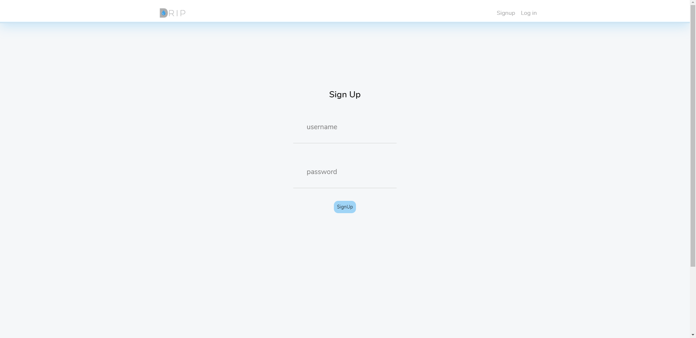

This project was bootstrapped with [Create React App](https://github.com/facebook/create-react-app).

## `Drip - Personal Project`

### Full Stack App created With React / Redux / Nodejs / Express / SQL / S3 / Bcryptjs

Mobile-friendly social media site inspired by Instagram.
• Structured tables using “Data Normalization” method for users, posts, comments and likes
• Learned and Implemented AWS S3 for image uploads
• Designed profiles for individual users that securely conditionally renders admin functions
• Utilized Express Sessions and Route Guarding to restrict unauthorized users from loading strict pages

### `Sign In View`

Desktop View

Sign In View - Where users can securely sign with username and password.

### `Sign Up View`

Desktop View

Sign Up View - Where users can securely register with username and password. usernames are unique and passwords are hashed with Bcrypt.js

### `Timeline View`

Desktop View

Timeline View - Where the logged in user scroll and see other users posts to like and comment

### `User Profile View`

Desktop View

User Profile View - every user has a profile and here the photos they posted are displayed, along with bio and username.

### `Signed in User Profile`

Desktop View

Signed in user view - Conditionally renders an edit button that allows you to edit your name, bio and update Avatar
